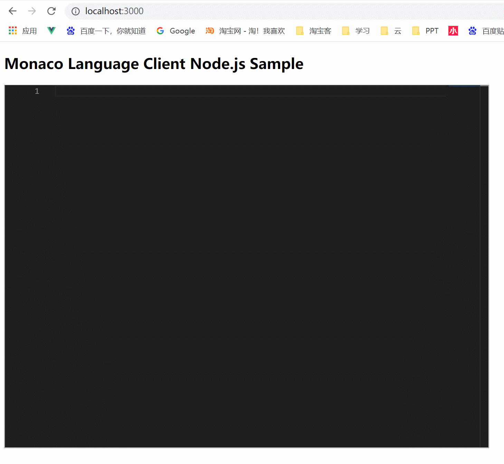

# monaco-editor-python

> monaco-editor 编辑器使用 jsonrpc-ws-proxy 和 python-language-server，实现 python 代码提示功能

## 效果



## 运行方式

1. 运行环境

- node.js 和 python 环境

2. 准备工作

- node.js 安装 npm 和 yarn
- python 安装`python-language-server`

  ```
  pip install python-language-server
  ```

3. 进入 web 目录，依次运行以下命令启动前端项目

   ```
   yarn
   yarn prepare
   yarn run start
   ```

4. 进入 server，依次运行以下命令启动代理程序

   ```
   npm install
   npm run prepare
   node dist/server.js --port 5000 --languageServers servers.yml
   ```

5. 访问 `http://localhost:3000`

## 博客教程

[https://www.qinyu.cc/archives/137.html](https://www.qinyu.cc/archives/137.html)
